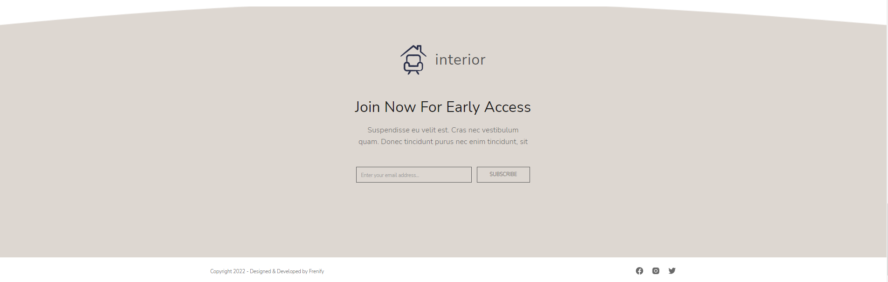

<h1 align="center"> Shop Interior </h1>
<a href="https://toptyns.github.io/Shop_website/">SITE</a>
<h2>Technologies</h2>
<ul>
  <li>HTML | 48.2%</li>
  <li>CSS | 25.5%</li>
  <li>JavaScript | 0.4%</li>
  <li>SCSS | 25.9%</li>
</ul>
<h2>Third Party Resources</h2>
<ul>
  <a href="https://github.com/itchief/ui-components/tree/master/itc-slider">Slider</a>
</ul>
<h2>Images</h2>

